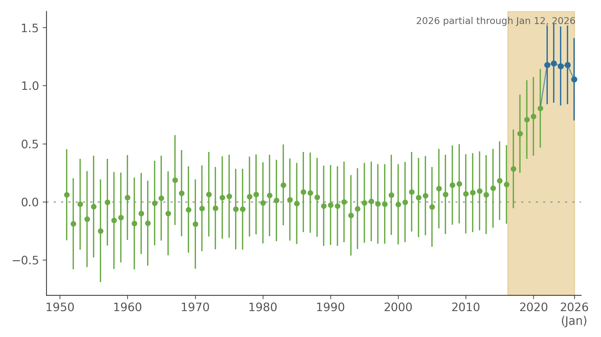

# Replicating And Extending The Shin Et Al. Go Chart

In March 2016, AlphaGo defeated Lee Sedol and changed how people thought about expert human judgment in Go. The important question was not only whether AI had become stronger than humans, but whether exposure to superhuman AI could actually improve human decision-making.

In 2023, Minkyu Shin, Jin Kim, Bas van Opheusden, and Thomas L. Griffiths published *"Superhuman artificial intelligence can improve human decision-making by increasing novelty"* in [PNAS](https://www.pnas.org/doi/10.1073/pnas.2214840120). Their paper used professional Go games through **2021** and reported a clear rise in human move quality after the AlphaGo era began.

This repository picks up from there. It does two things:

1. reruns the paper's released historical results from the authors' public archive
2. builds a separate continuation of the main chart with more recent data

Why this matters: the original paper was an important claim about AI helping humans get better, not just automating them. But the public result stopped at 2021. This repo asks the simple follow-up question: **did that uplift persist in later years?**

Reference links:

- paper: [PNAS](https://www.pnas.org/doi/10.1073/pnas.2214840120)
- public records: [PubMed](https://pubmed.ncbi.nlm.nih.gov/36913582/), [PMC](https://pmc.ncbi.nlm.nih.gov/articles/PMC10041097/), [OSF](https://osf.io/xpf3q/)

## Main Result

This is the main chart in the repo. Each dot is one year. Higher means stronger human moves by the AI evaluator's standard. The line is centered so that the **pre-AlphaGo average is 0**, which makes the post-2016 uplift easy to read. The blue-shaded years are the post-`2021` continuation.



The short reading is:

- the historical uplift reported in the paper is real and reruns from the released public materials
- using newer games, the continuation here still stays well above the pre-AlphaGo norm after `2021`
- the effect does not disappear once the original paper window ends

Raw-reference version:

- [results/paper_like_extension/paper_like_extension_chart.png](results/paper_like_extension/paper_like_extension_chart.png)

## What We Did

There are two distinct products in this repo.

**1. Exact historical rerun**

We reran the released `1950–2021` historical outputs from the authors' public OSF package and reproduced the released numerical series to reported precision.

- outputs: [results/exact_replication](results/exact_replication)

**2. Paper-like continuation**

We then built a separate continuation of the yearly chart using:

- recent GoGoD professional game records
- KataGo as the move evaluator
- a frozen independently reconstructed metric chosen to match the paper's historical line closely

This second part is intentionally described as **paper-like**, not exact. The authors' full unreleased post-`2021` move-level pipeline is not public, so this repo does **not** claim to recover their hidden metric exactly. Instead, it builds a close and explicit continuation on its own terms.

## What The Result Means

The broad conclusion is not just that AI became stronger than human Go players. It is that, in this domain, strong AI appears to have changed how humans play, and that the improvement remained visible in the later data examined here.

That makes this a small but concrete case study in a larger question: when frontier AI arrives in an expert field, does human performance collapse, stagnate, or improve? In Go, the answer still looks much closer to **improve**.

## Where To Look

- main chart: [results/paper_like_extension/paper_like_extension_prealphago_centered.png](results/paper_like_extension/paper_like_extension_prealphago_centered.png)
- continuation summary: [results/paper_like_extension/summary.json](results/paper_like_extension/summary.json)
- historical yearly rerun: [results/exact_replication/fig1_panel_a_yearly.csv](results/exact_replication/fig1_panel_a_yearly.csv)
- methods: [docs/METHODS.md](docs/METHODS.md)
- data and licensing boundary: [docs/DATA.md](docs/DATA.md), [LICENSE.md](LICENSE.md)

## Reproducing The Public Historical Rerun

This one-liner reproduces the released historical results from the public archive:

```bash
python3 -m venv .venv && . .venv/bin/activate && pip install -r requirements_replication.txt && python3 scripts/fetch_public_osf_release.py && python3 scripts/verify_public_inputs.py && Rscript scripts/install_r_deps.R && Rscript scripts/run_shin_main_text_full_r.R
```

That public path covers the historical rerun only.

The post-`2021` continuation is not a clean-clone rerun target. It additionally needs:

- private GoGoD game archives
- a local KataGo installation and model

## Repo Layout

- `results/`: main outputs and review-facing artifacts
- `scripts/`: reruns, validation, metric search, packaging
- `docs/`: methods, data notes, environment details
- `public_refs/go_learning_eras/`: public bridge data
- `osf/`: local fetch target for the authors' public archive

## Data Boundary

This repo does not include proprietary GoGoD archives, KataGo binaries, model weights, or the large scratch `outputs/` tree used during exploration.

It does include the code, documentation, public bridge data, exact historical rerun artifacts, and aggregate continuation artifacts needed to inspect the result.

See [docs/DATA.md](docs/DATA.md) for the full boundary.
