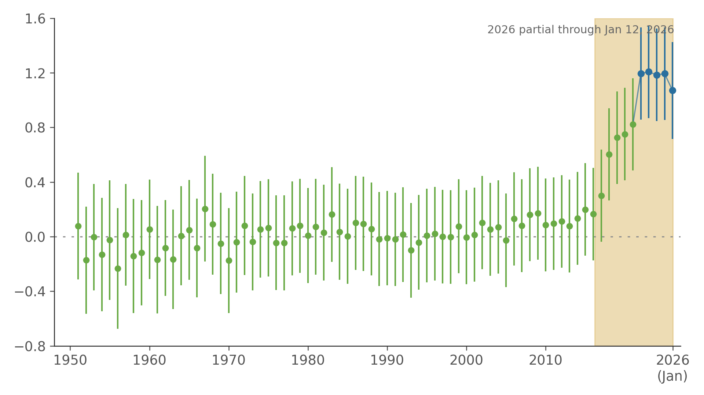

# Replicating And Extending The Shin Et Al. Go Decision-Quality Chart

This repository packages the finished replication and extension work around the Go decision-quality chart from Shin et al.

It has two distinct products:

1. An exact replication of the released historical outputs that can be reproduced from the authors' public OSF materials.
2. A robust paper-like continuation of the uplift chart beyond `2021`, built with a frozen independently reconstructed metric rather than claiming access to the authors' hidden full post-`2021` pipeline.

Reference paper:

- Jaehyun Shin, D. Sculley, Samy Bengio, and others, "Superhuman AI for the strategy game Go inspires human players," [PNAS](https://www.pnas.org/doi/10.1073/pnas.2214840120)
- Preprint version used at the start of this project: [arXiv:2311.11388](https://arxiv.org/pdf/2311.11388)

## Main Result

The chart this repository is built around is the paper-like continuation below:



The pre-AlphaGo-centered view is often easier to interpret:


Headline numbers for the final continuation metric:

- Historical fit to the paper's yearly line: `corr = 0.9884`, `MAE = 0.0192`
- Historical uplift vs pre-AlphaGo mean:
  - paper: `+0.5410`
  - final paper-like metric: `+0.5448`
- Latest extension values:
  - `2022`: `1.1949`
  - `2023`: `1.2070`
  - `2024`: `1.1848`
  - `2025`: `1.1939`
  - `2026`: `1.0706` (partial year through `2026-01-12`)

## What This Repository Contains

- `osf/`
  - the public OSF replication materials released by the authors
- `public_refs/go_learning_eras/`
  - the public `games.csv` and `players.csv` bridge files used for crosswalking recent GoGoD players to the historical OSF population
- `scripts/`
  - the R and Python pipelines used for replication, validation, candidate search, and extension
- `results/`
  - a curated, commit-sized bundle of the exact replication outputs, reverse-engineering selection artifacts, and final extension outputs
- `docs/`
  - methods, data notes, and packaging details

This repo intentionally does not commit the large scratch `outputs/` tree, runtime logs, KataGo models, or proprietary GoGoD archives.

## Exact Replication Vs. Independent Continuation

These two result classes should not be conflated.

### Exact historical replication

The committed exact-replication artifacts come from rerunning the released author workflow against the OSF data:

- yearly Figure 1A series: [results/exact_replication/fig1_panel_a_yearly.csv](results/exact_replication/fig1_panel_a_yearly.csv)
- monthly Figure 1B series: [results/exact_replication/fig1_panel_b_monthly.csv](results/exact_replication/fig1_panel_b_monthly.csv)
- reproduced Figure 1A image: [results/exact_replication/fig1_panel_a_reproduced.png](results/exact_replication/fig1_panel_a_reproduced.png)
- Table 1 coefficients:
  - [results/exact_replication/table_1_model_1_coefficients.csv](results/exact_replication/table_1_model_1_coefficients.csv)
  - [results/exact_replication/table_1_model_2_coefficients.csv](results/exact_replication/table_1_model_2_coefficients.csv)

This part is an exact reproduction of the released public analysis objects and is the right reference point for the published `1950-2021` historical series.

### Independent paper-like continuation

The final extension is not presented as the authors' exact hidden post-`2021` metric.

Instead, it is a frozen independently reconstructed metric chosen by blind historical evaluation:

- candidate search artifacts:
  - [results/reverse_engineering/wave_002_refinement_search_leaderboard.csv](results/reverse_engineering/wave_002_refinement_search_leaderboard.csv)
  - [results/reverse_engineering/wave_002_refinement_robustness_leaderboard.csv](results/reverse_engineering/wave_002_refinement_robustness_leaderboard.csv)
  - [results/reverse_engineering/wave_002_monthly_audit_leaderboard.csv](results/reverse_engineering/wave_002_monthly_audit_leaderboard.csv)
- final extension artifacts:
  - [results/paper_like_extension/combined_yearly_fe.csv](results/paper_like_extension/combined_yearly_fe.csv)
  - [results/paper_like_extension/summary.json](results/paper_like_extension/summary.json)
  - [results/paper_like_extension/paper_like_extension_overlay.png](results/paper_like_extension/paper_like_extension_overlay.png)

The winning metric is `raw_2_60_affine`:

- move window `2-60`
- move `1` excluded by design
- yearly fixed-effects structure matched to the paper
- affine calibration frozen on historical years only
- recent years scored from GoGoD `2021-2026` games with KataGo and the same frozen methodology

## What Is Different From The Original Paper

The important differences are methodological, not cosmetic:

- The paper's released historical chart is reproduced exactly from the OSF release, but the authors' full raw move-level DQI construction is not completely recoverable from public materials alone.
- The final extension here does not claim to use the authors' exact hidden post-`2021` DQI pipeline.
- The final extension metric excludes move `1`, because move-`1` DQI could not be independently reconstructed from public provenance to a standard we were willing to defend.
- The continuation uses a linked recent GoGoD population rather than every OSF player.
- Recent years are built from a frozen sampled recent-game rule (`k = 3` games per player-year) and a frozen KataGo setup (`20` visits, per-game rules and komi handling).
- `2026` is partial-year data through `2026-01-12`.

That means the right interpretation is:

- exact historical replication for the released paper outputs
- paper-like, peer-review-defensible continuation for the post-`2021` chart

## Validation Snapshot

The strongest validation numbers are in [results/paper_like_extension/summary.json](results/paper_like_extension/summary.json).

Key checks:

- historical vs paper yearly line:
  - `corr = 0.9884`
  - `MAE = 0.0192`
- historical sampling sensitivity:
  - `corr = 0.9912`
  - `MAE = 0.1411`
- matched `2021` overlap:
  - game-player: `n = 730`, `corr = 0.4344`, `MAE = 0.4501`
  - player-year: `n = 142`, `corr = 0.7068`, `MAE = 0.4678`
- yearly bridge continuity at the splice:
  - `corr = 0.9999`
  - `MAE = 0.0024`

The current verdict is:

- exact released historical replication: yes
- final paper-like continuation: publishable with caveats
- exact hidden author post-`2021` metric: still not claimed

## Reproducing The Repository Outputs

Public exact replication:

```bash
Rscript scripts/run_shin_main_text_full_r.R
```

Paper-like continuation:

```bash
python scripts/build_independent_uplift_chart.py --metric-label paper_like_raw_2_60_affine_visits_20 --move-start 2 --move-end 60 --sample-games-per-player-year 3 --recent-score-start-date 2022-01-01 --max-visits 20 --affine-intercept 0.0022387165680807 --affine-slope 0.9404497155357116 --recent-zip data/private/2021-2026-Database-Jan2026.zip --katago-path /path/to/katago --katago-config /path/to/analysis_example.cfg --katago-model /path/to/g170e-b20-model.bin.gz
```

The second command requires proprietary GoGoD inputs and a local KataGo installation. Those assets are intentionally not committed here; see [docs/DATA.md](docs/DATA.md).

## Where To Start

- [docs/METHODS.md](docs/METHODS.md)
- [docs/DATA.md](docs/DATA.md)
- [results/README.md](results/README.md)
